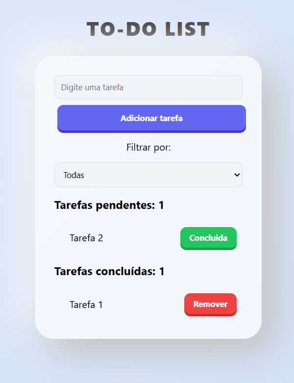

# ✅ To-do List - Gerenciamento de Estado com Recoil



Uma aplicação de gerenciamento de tarefas desenvolvida em **React**, com foco na implementação de **estado global** utilizando a biblioteca **Recoil**. O projeto demonstra como organizar e derivar estado de forma eficiente através de átomos, seletores e selectorFamily.

## 🚀 Funcionalidades

- **Adicionar Tarefas:** Campo de entrada para criação de novas tarefas com validação de input.
- **Listagem Dinâmica:** Exibição das tarefas separadas por status (pendentes e concluídas) com contagem em tempo real.
- **Marcar como Concluída:** Atualização imutável do estado da tarefa sem remoção do array.
- **Remover Tarefas:** Exclusão permanente de qualquer tarefa da lista.
- **Filtros Inteligentes:** Exibição por categoria — Todas, Concluídas ou Pendentes — com títulos e contadores dinâmicos.
- **Estado Derivado:** Lógica de filtragem e contagem abstraída em seletores, mantendo os componentes limpos.

## 🛠️ Tecnologias Utilizadas

- **React.js** (Biblioteca principal)
- **Vite** (Build tool de alta performance)
- **Recoil** (Gerenciamento de estado global)
- **JavaScript ES6+** (Sintaxe moderna e manipulação de arrays)

## 🧠 Conceitos Aplicados (Requisitos da Atividade)

Este projeto foi desenvolvido para consolidar os conhecimentos do módulo de Recoil, focando nos seguintes pilares:

1. **RecoilRoot como Provedor:** Configuração do `RecoilRoot` no `main.jsx` como provedor global da aplicação, habilitando o acesso ao estado em toda a árvore de componentes.
2. **Átomos:** Criação de `taskState` para armazenar a lista de tarefas (com propriedade `done`) e `filterState` para o filtro ativo, ambos como fontes únicas de verdade.
3. **Seletores Derivados:** Implementação do `filteredTasksSelector` que observa `taskState` e `filterState` simultaneamente, retornando a lista correta sem lógica duplicada nos componentes.
4. **Composição de Seletores:** O `taskCounter` consome `filteredTasksSelector` diretamente, demonstrando como seletores podem ser construídos em cima de outros seletores.
5. **SelectorFamily:** Uso do `selectorFamily` no `taskCounter` para aceitar parâmetros externos (`done: true/false`), permitindo contagens independentes por grupo sem repetição de lógica.
6. **Imutabilidade:** Atualização de estado com `map` e spread operator (`{...item, done: true}`), garantindo que o React detecte as mudanças e re-renderize corretamente.
7. **Organização de Componentes:** Separação clara entre `atoms`, `selectors`, `components` e `pages`, promovendo um código limpo e de fácil manutenção.

## 💻 Instruções para rodar o projeto localmente

Siga os passos abaixo para configurar o ambiente em sua máquina:

1. **Clone este repositório:**
```
git clone https://github.com/LeooSeixas/EBAC-M20-Recoil.git
```

2. **Acesse a pasta do projeto:**
```
cd nome-do-repositorio
```

3. **Instalar as dependências:**
```
npm install
```

4. **Executar a aplicação:**
```
npm run dev
```

5. **Acessar no navegador:**
```
O Vite geralmente abrirá o projeto em http://localhost:5173.
```

---

Desenvolvido por Leonardo Seixas - Estudo de React Avançado.
